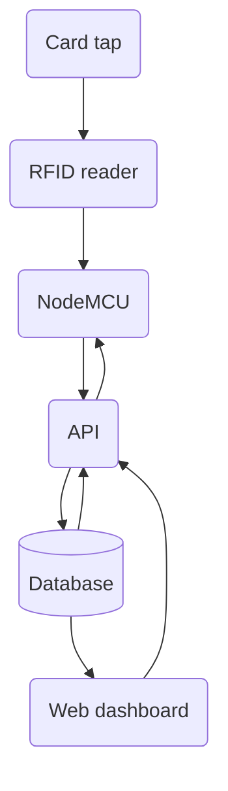
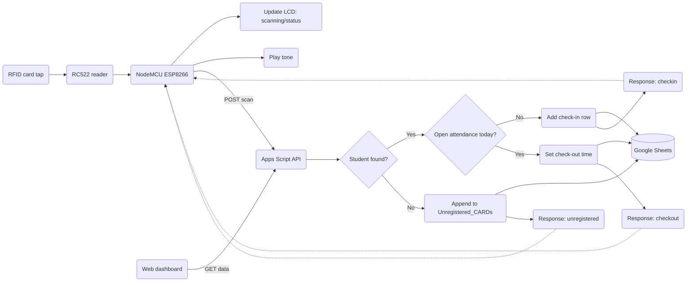

# CloudAttend

CloudAttend helps you record attendance with RFID and Google Sheets. Tap a card to check in or check out; the device shows status on an LCD and writes to the cloud.

## Philosophy Behind the Project

Pause and read

> “There is no such thing as a new idea. It is impossible. We simply take a lot of old ideas and put them into a sort of mental kaleidoscope. We give them a turn and they make new and curious combinations. We keep on turning and making new combinations indefinitely; but they are the same old pieces of colored glass that have been in use through all the ages.”
>
> — [Mark Twain, Mark Twain's Own Autobiography: The Chapters from the North American Review](https://www.goodreads.com/quotes/843880-there-is-no-such-thing-as-a-new-idea-it)

There are many projects built with the same components — ESP8266, RFID, and LCD — but what makes **CloudAttend** different is not just _what_ components are used, but _how_ they’re connected and designed to work together.
The **system architecture**, **data flow**, and **integration approach** bring a new perspective on how these modules can create a seamless and cloud-connected attendance system.

## Overview

## What’s inside

| Layer           | Technology / component                 | Description                                  |
| --------------- | -------------------------------------- | -------------------------------------------- |
| Microcontroller | NodeMCU ESP-12E ESP8266 (Arduino Core) | Handles RFID scans, Wi‑Fi, and LCD updates   |
| RFID reader     | RC522 (MFRC522 library)                | Reads card UIDs                              |
| Display         | 16×2 I2C LCD (LiquidCrystal_I2C)       | Shows real‑time status                       |
| Feedback        | Active buzzer                          | Short tones for confirmation                 |
| Cloud API       | Google Apps Script                     | REST endpoint for the device                 |
| Database        | Google Sheets                          | Students, Attendance, and Unregistered cards |
| Frontend        | Vanilla JavaScript, HTML, CSS          | Dashboard to view and manage records         |
| Hosting         | GitHub Pages                           | Serves the dashboard                         |

## Hardware pinout

| Component         | Function | NodeMCU pin |
| ----------------- | -------- | ----------- |
| RC522 RFID reader | SDA (SS) | D8          |
|                   | SCK      | D5          |
|                   | MOSI     | D7          |
|                   | MISO     | D6          |
|                   | RST      | D3          |
| 16×2 I2C LCD      | SDA      | D2          |
|                   | SCL      | D1          |
|                   | VCC      | VIN         |
|                   | GND      | GND         |
| Buzzer            | Signal   | D0          |
| Power             | VCC      | 3.3V        |
|                   | GND      | GND         |

## Architecture

## Database structure on Google Sheet

| Sheets             | Columns                                                                      |
| ------------------ | ---------------------------------------------------------------------------- |
| Students           | `CARD_UID`, `SUID`, `FirstName`, `LastName`                                  |
| Attendance         | `CARD_UID`, `SUID`, `Date`, `DateKey`, `CheckInTime`, `CheckOutTime`, `Name` |
| Unregistered_CARDs | `CARD_UID`, `Date`, `Time`, `Status`                                         |

## Beyond v0.1

- **Migrate to a proper database** such as **PostgreSQL** or **MySQL** for reliability and scalability.
- **Adopt a modern frontend framework** like **Bootstrap** or **React** to improve UI consistency and responsiveness.
- **Implement authentication** on the dashboard (admin / teacher login) to secure attendance data.
- **Add mobile-friendly PWA (Progressive Web App)** support for quick access and offline viewing.
- **Integrate notifications** — email or Telegram alerts when attendance is marked or unusual patterns are detected.

## Project Members

| Name                  | Role                                     | Contribution                                                                                                                                                                                                                                                                                                                   |
| --------------------- | ---------------------------------------- | ------------------------------------------------------------------------------------------------------------------------------------------------------------------------------------------------------------------------------------------------------------------------------------------------------------------------------ |
| **Darshan Gangani**   | _System Designer & Full-Stack Developer_ | Designed the overall project architecture and contributed to all phases including NodeMCU firmware, Google Apps Script API, and the web dashboard. Handled integration, testing, hardware interfacing, and documentation.                                                                                                      |
| **Shrey Viradiya**    | _Hardware Integration & Testing_         | Led the setup and calibration of hardware components including the RFID module, LCD display, buzzer, and NodeMCU. Ensured circuit reliability, handled power management, and optimized signal accuracy. Actively contributed to firmware and hardware debugging, ensuring stable system operation under real-world conditions. |
| **Sumit Kalsariya**   | _Embedded Systems Developer_             | Focused on ESP8266 firmware logic, RFID data handling, and smooth synchronization with the Google Apps Script API. Contributed to debugging, optimization, and communication reliability between hardware and cloud endpoints.                                                                                                 |
| **Vaibhav Kunjadiya** | _Web & Cloud Developer_                  | Developed the dashboard interface, implemented API interactions, and maintained real-time data syncing with Google Sheets. Contributed to UI improvements and performance optimization for the web interface.                                                                                                                  |

## References

- [Original Ideas are Overrated](https://www.youtube.com/watch?v=41IMbwQR-dc)
- [3 Shadows (CodePen by Sajid)](https://codepen.io/whosajid/pen/LEGRBzp) - Dark theme and subtle elevation inspiration.

- **Libraries and board support**

  - [ESP8266 Arduino Core](https://github.com/esp8266/Arduino) — Official board support for the ESP8266.
  - [LCDGraph](https://github.com/jgOhYeah/LCDGraph) — Optional Arduino library for drawing simple graphs on alphanumeric displays (compatible with LiquidCrystal I2C).
  - [LiquidCrystal_I2C](https://github.com/markub3327/LiquidCrystal_I2C) — I2C interface library for 16×2 LCD displays.
  - [MFRC522](https://github.com/miguelbalboa/rfid) — RFID reader library for the RC522 module.

- **Project Learning resources**

  - [RFID EXPLAINED by Mikael Abehsera](https://www.youtube.com/watch?v=npEjhi0IHKo)
  - [ESP8266 RFID Attendance System with Google Sheets](https://www.viralsciencecreativity.com/post/esp8266-rfid-attendance-system-with-google-sheets)
